# Simple Docker

Введение в докер. Разработка простого докер-образа для собственного сервера.

## Part 1. Готовый докер

В этой главе разберемся с готовым докер образом ngnix.

- Возьмем официальный докер-образ с nginx и выкачаем его при помощи `docker pull ngnix`.  
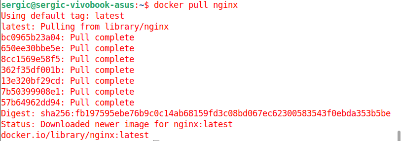

- Проверим наличие докер-образа через `docker images`.  
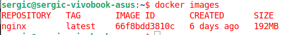

- Запустим докер-образ через `docker run -d 66f8bdd3810c`.  
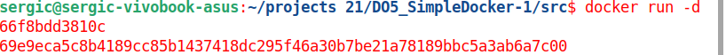

- Проверим, что образ запустился через `docker ps`.  
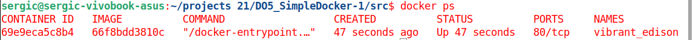

- Посмотрим информацию о контейнере через `docker inspect 69e9eca5c8b4`.  
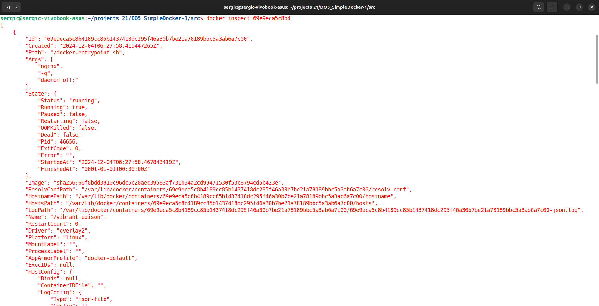

- Размер контейнера равен *67108864*.  
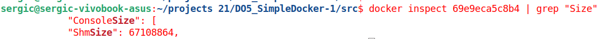

- Нет замапленых портов.  
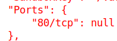

- Ip контейнера  
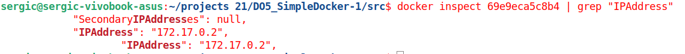

- Остановим докер контейнер через `docker stop 69e9eca5c8b4` и проверим что он остановился `docker ps`.  
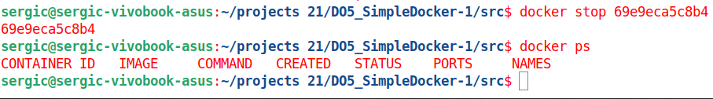

- Запустим докер с портами 80 и 443 в контейнере, замапленными на такие же порты на локальной машине, через команду `docker run -d -p 80:80 -p 443:443 66f8bdd3810c`.  
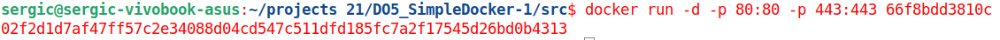

- Проверяем localhost:80.  
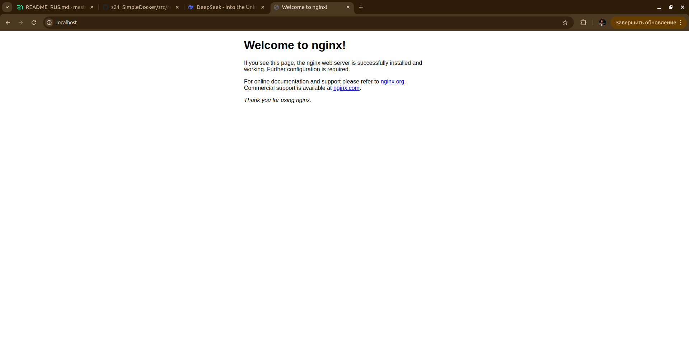

- Перезапустим докер контейнер через `docker restart 02f2d1d7af47` и проверим что он перезапустился  `docker ps`.  
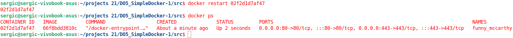

- Проверяем что контейнер перезапустился localhost:80.  
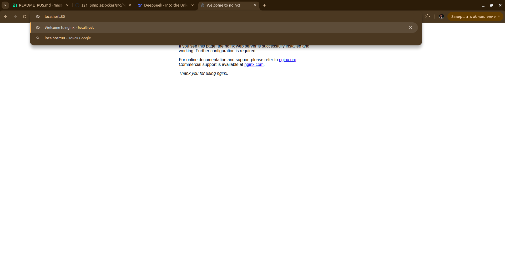

## Part 2. Операции с контейнером

В этой главе поработаем с конфигурациями nginx и отобразим статус страницы.

- Прочитаем конфигурационный файл nginx.conf внутри докер контейнера через команду `docker exec 02f2d1d7af47 cat /etc/nginx/nginx.conf`.  
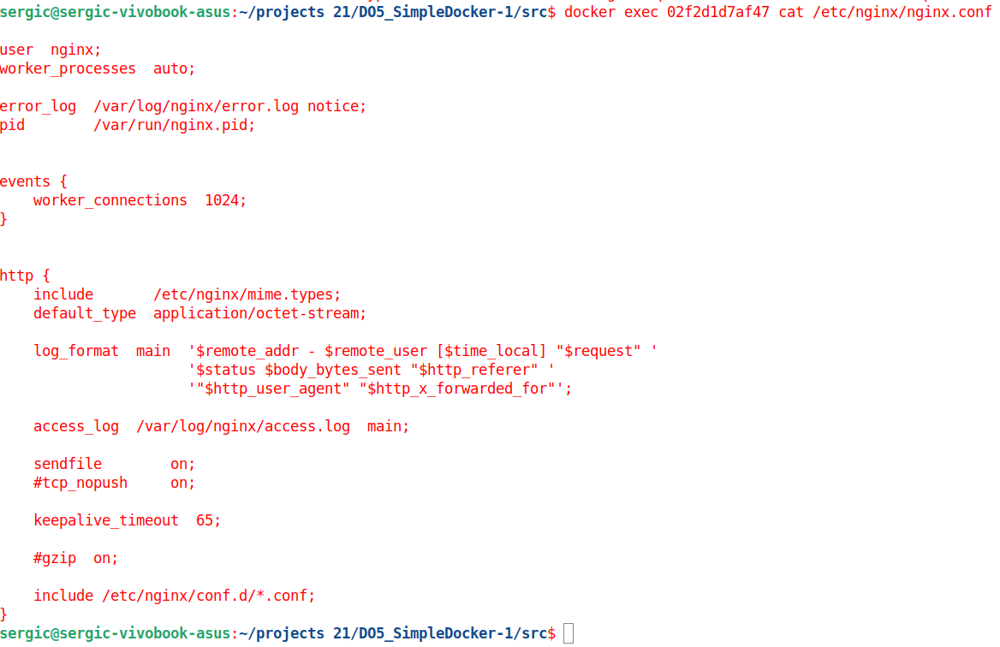

- Создим на локальной машине файл nginx.conf.  
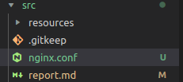

- Настрим в нем по пути /status отдачу страницы статуса сервера nginx.  
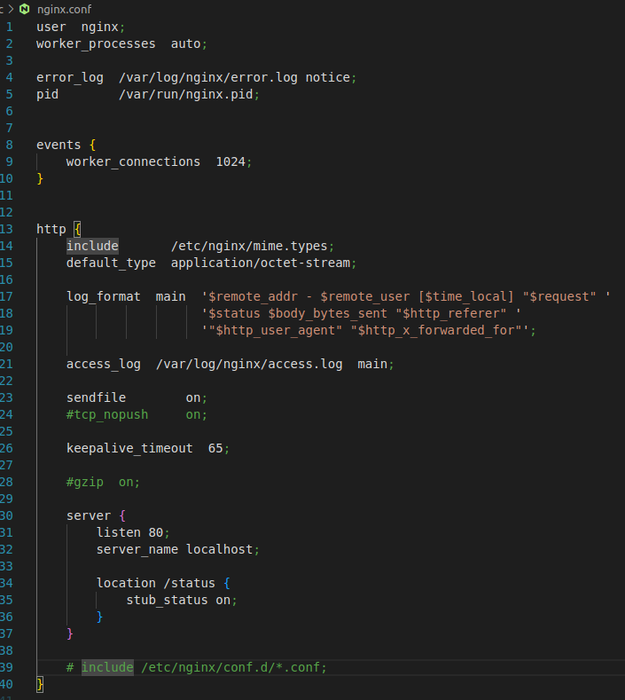

- Скопируем созданный файл nginx.conf внутрь докер-образа через команду `docker cp nginx.conf 02f2d1d7af47:etc/nginx/`.  
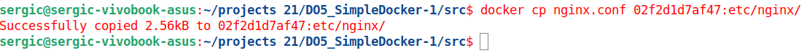

- Проверим что файл сопировался с помощью командыы `docker exec 02f2d1d7af47 cat /etc/nginx/nginx.conf`.  
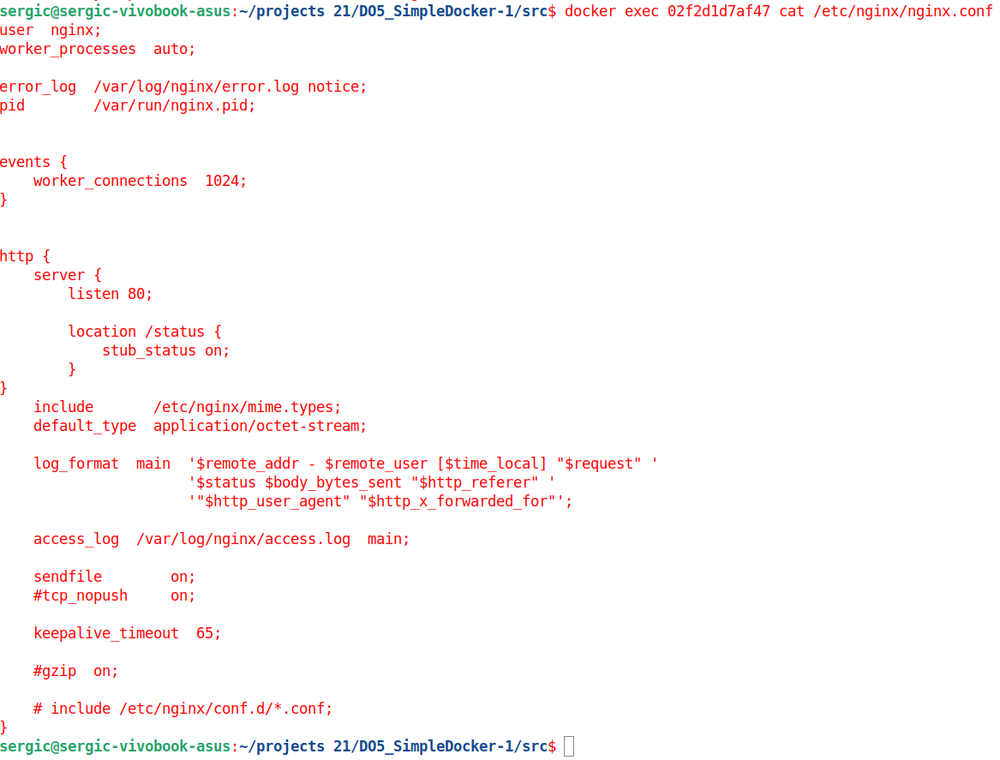

- Перезапустим nginx внутри докер-образа через команду `docker exec 02f2d1d7af47 nginx -s reload`.  
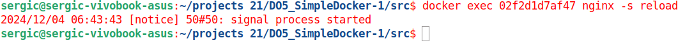

- Проверим, что по адресу localhost:80/status отдается страничка со статусом сервера nginx.  
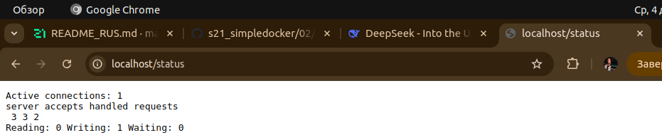

- Экспортируем контейнер в файл container.tar через команду `docker export 02f2d1d7af47 > container.tar`.  
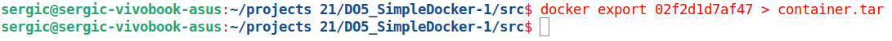

- Остановим контейнер `docker stop 02f2d1d7af47`.  
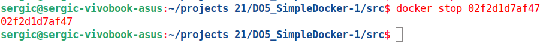

- Удали образ через `docker rmi -f nginx`, не удаляя перед этим контейнеры.  

- Удалим остановленный контейнер `docker rm 02f2d1d7af47`.  
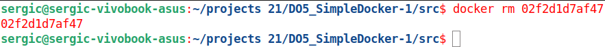

- Импортируем контейнер обратно через команду `docker import container.tar titandea`.  
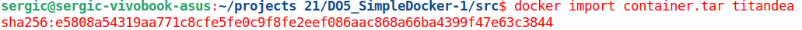

- Провери образы `docker images`.  
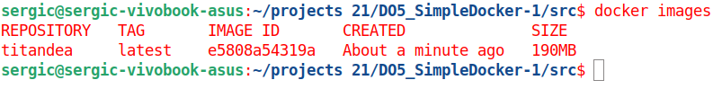

- Запустим контейнер `docker run -d -p 80:80 -p 443:443 e5808a54319a nginx -g "daemon off;"`. Так как при импорте не была укзана команда по умалчанию при запуске контейнера, то укажем команду вручную.  
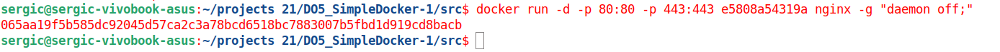

- Проверим, что по адресу localhost:80/status отдается страничка со статусом сервера nginx.  
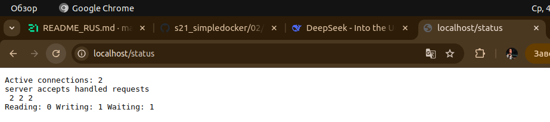

## Part 3. Операции с контейнером

В этой главе напишем свой докер сервер.

- Обновим все пакеты, а так же установим необходимые. `sudo apt update` -> `sudo apt-get install libfcgi-dev` -> `sudo apt install spawn-fcgi`
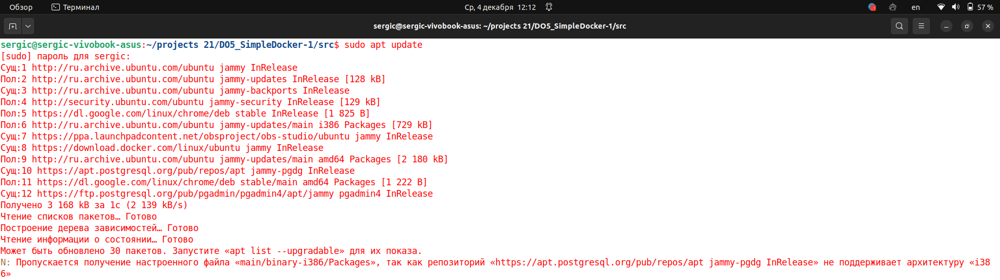
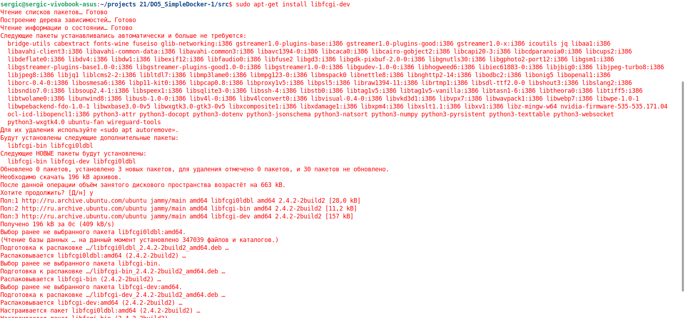
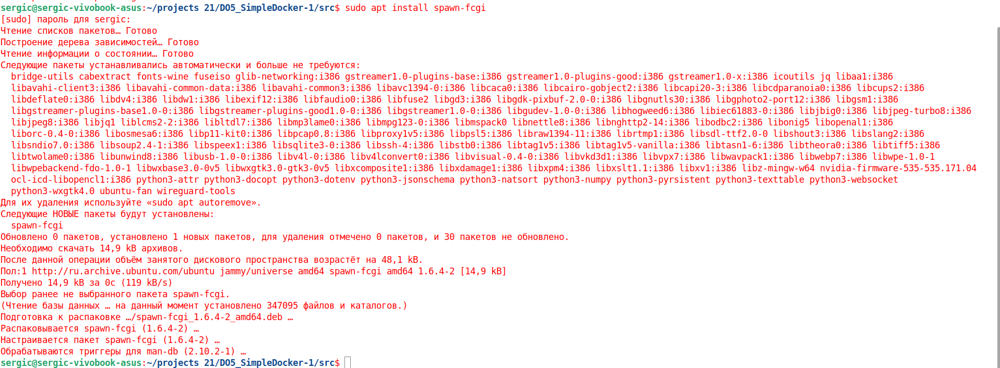

- Напишем код сервера.  
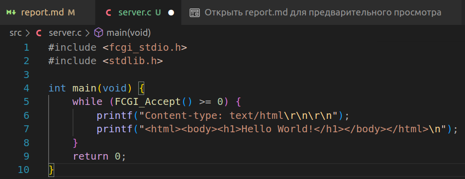

- Скачем образ ngnix с помщью `docker pull ngnix`.  
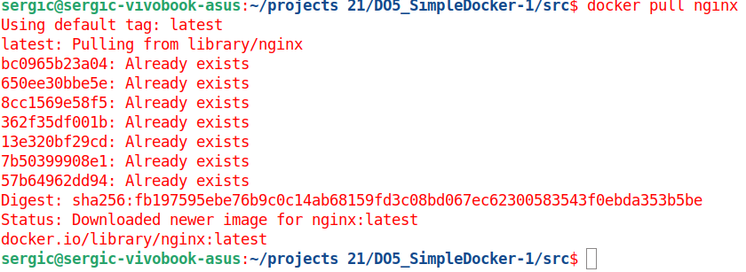

- Скомпилируем сервер `gcc -Wall -Werror -Wextra server.c -lfcgi -o server.cgi`
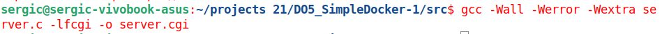

- Запустим докер с портами 80 и 443 в контейнере, замапленными на такие же порты на локальной машине, через команду `docker run -d -p 80:80 -p 443:443 66f8bdd3810c`.  
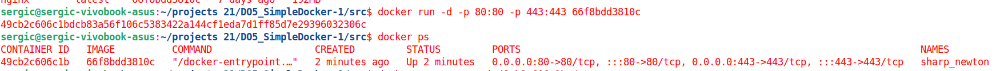 

- Скопируем скомпилированный сервер в контейнер `docker cp server.cgi 49cb2c606c1b:/`.  
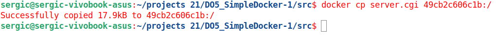

- Установим spawn-fcgi в контейнер `docker exec 49cb2c606c1b apt-get update` -> `docker exec 49cb2c606c1b apt-get install spawn-fcgi`.  
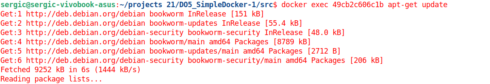  
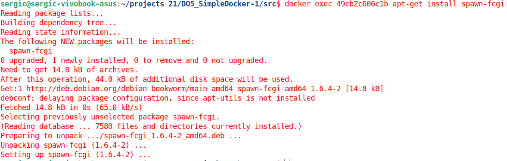

- Зайдем в директорию контейнера и установим libfcgi0ldbl `docker exec -it 49cb2c606c1b /bin/bash` -> `apt-get install libfcgi0ldbl`.  
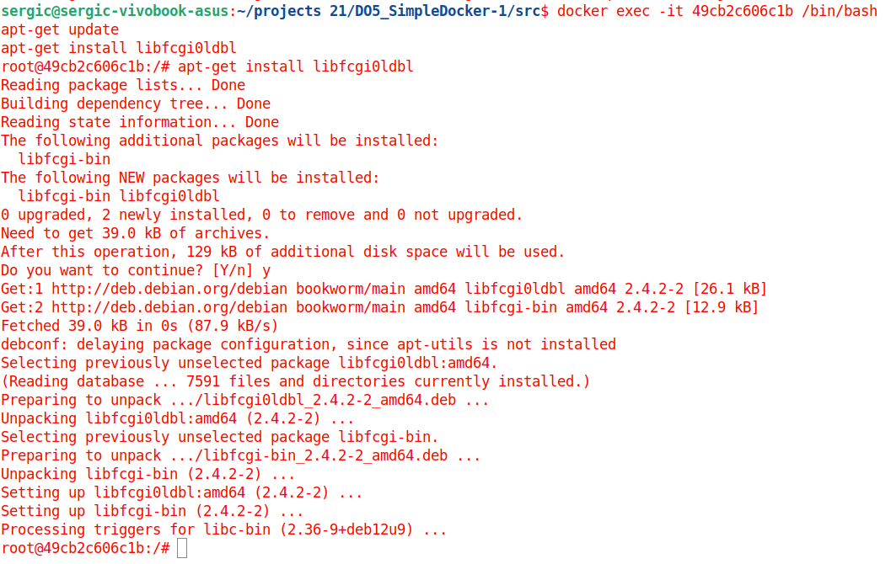

- Запустим `docker exec 49cb2c606c1b spawn-fcgi -p 8080 -n server.cgi`.  
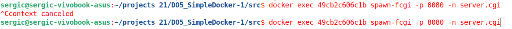

- Напиши свой nginx.conf, который нужен для запуска своего сервера.    
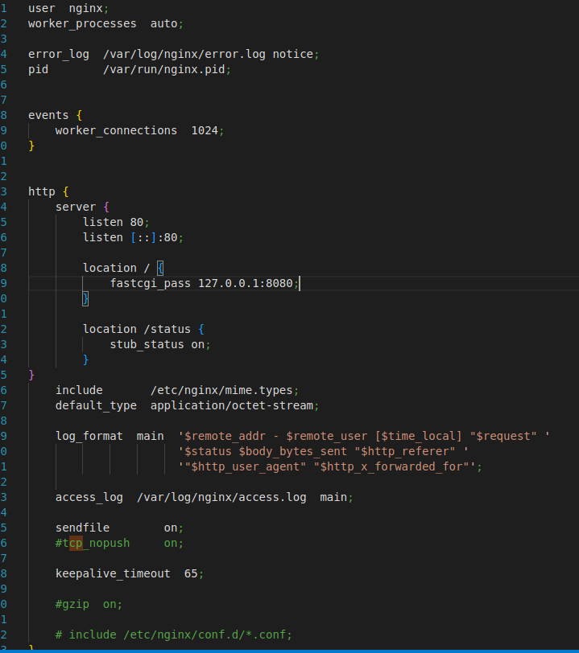

- Скопируем созданный файл nginx.conf внутрь докер-образа через команду `docker cp nginx.conf 49cb2c606c1b:etc/nginx/`.  
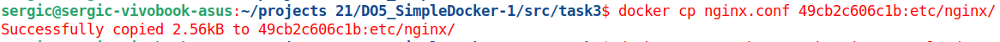

- Перезапустим nginx внутри докер-образа через команду `docker exec 02f2d1d7af47 nginx -s reload`.  
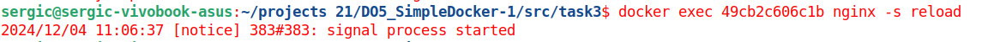

- Проверим, что по адресу localhost:80 отдается страничка "Hello World!".    
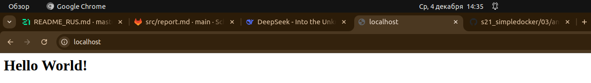

- Напиши свой nginx.conf, который будет проксировать все запросы с 81 порта на 127.0.0.1:8080. Так как нынешний контейнер запускается с замаппленными портами 80 и 443, необходимо сохранить новый образ на основе этого контейнера и перезапустить с замапленым поротом 81.  
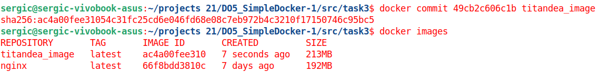
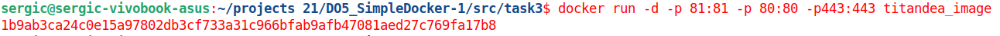

- Скопируем созданный файл nginx.conf внутрь докер-образа через команду `docker cp nginx.conf 41a2634fd10c:etc/nginx/`.  
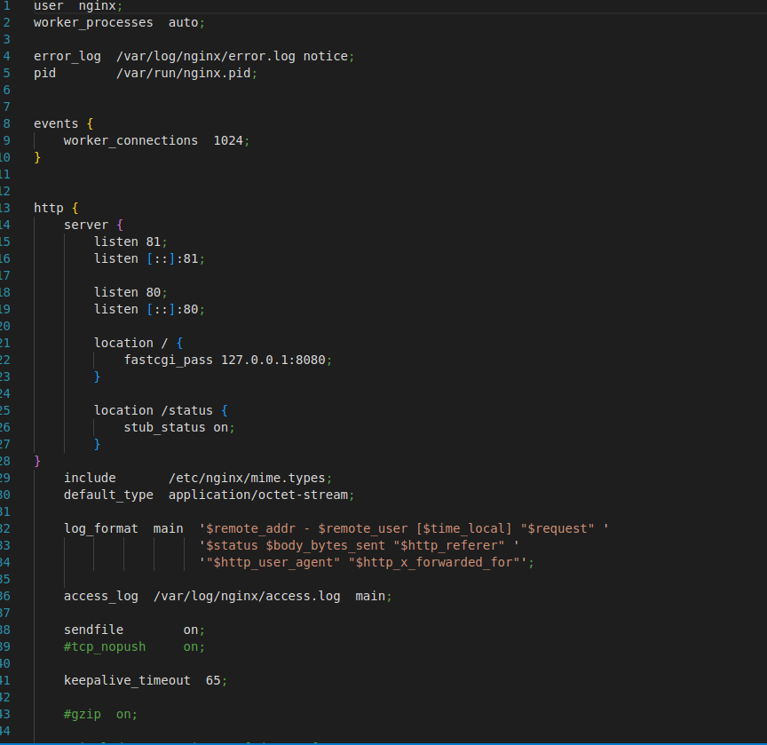
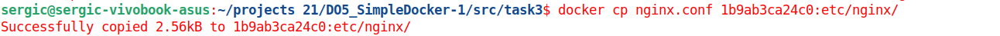

- Перезапустим nginx внутри докер-образа через команду `docker exec 41a2634fd10c nginx -s reload`.  
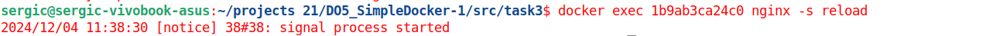

- Проверим, что по адресу localhost:80 отдается страничка "Hello World!".  
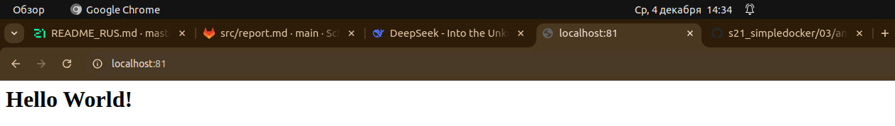

## Part 4. Операции с контейнером

В этой главе напишем докер образ для созданного сервера.

- Напишем свой докер-образ, который:  

    1) собирает исходники мини сервера на FastCgi из Части 3;  

    2) запускает его на 8080 порту;  

    3) копирует внутрь образа написанный ./nginx/nginx.conf;  

    4) запускает nginx. (nginx можно установить внутрь докера самостоятельно, а можно воспользоваться готовым образом с nginx'ом, как базовым).  
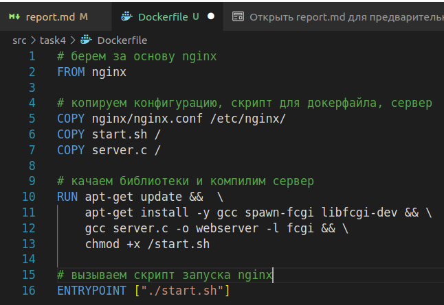
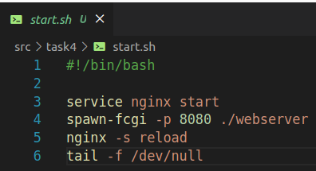

- Создадим скрипт build.sh, который будет собирать образ и запускать контейнер с маппингом 81 порта на 80 на локальной машине и маппингом папки ./nginx внутрь контейнера по адресу, где лежат конфигурационные файлы nginx'а.  
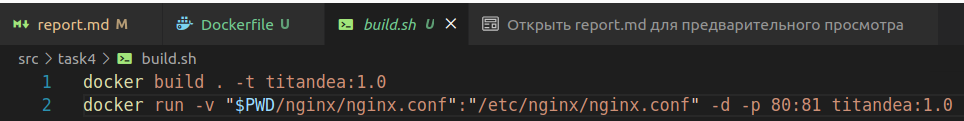

- Проверим что build.sh все собрал и что все работает.  
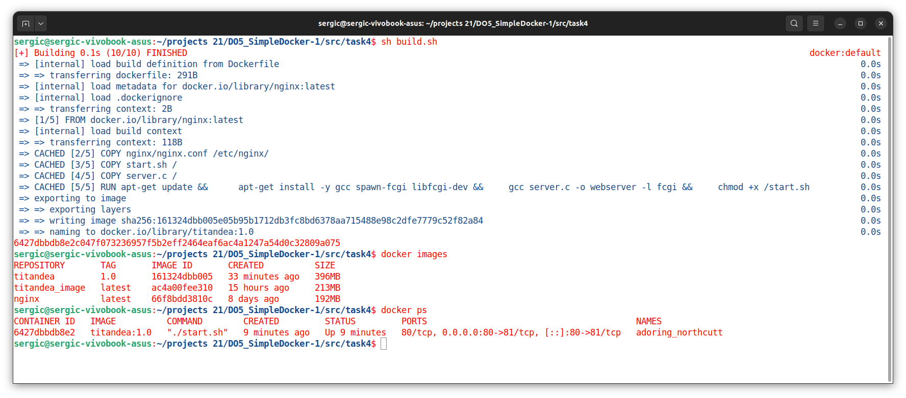

- Проверим, что по localhost:80 доступна страничка написанного мини сервера.  
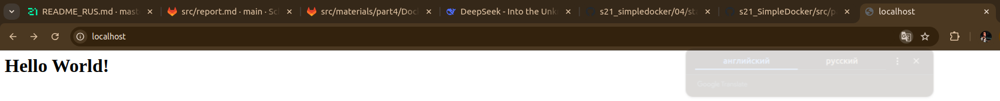

- Проверим, что теперь по localhost:80/status отдается страничка со статусом nginx.  
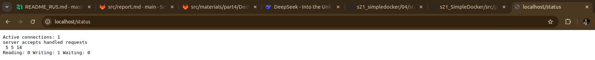

## Part 5. Dockle

В этой главе провери написанный докер образ на правильность с помощью Dockle.  

- Скачаем Dockle `curl -L -o dockle.deb https://github.com/goodwithtech/dockle/releases/download/v0.4.14/dockle_0.4.14_Linux-64bit.deb` -> `sudo dpkg -i dockle.deb && rm dockle.deb`.  
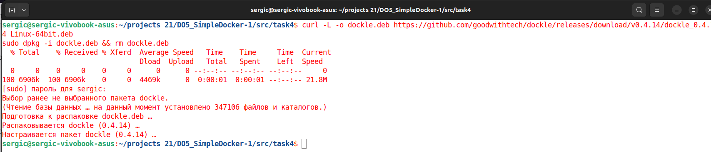

- Просканируем наш образ.  
    - Первая ошибка возникает в связи с использованием nginx. Так как по заданию нужно использовать nginx, то эту ошибку мы исправлять не будем.  
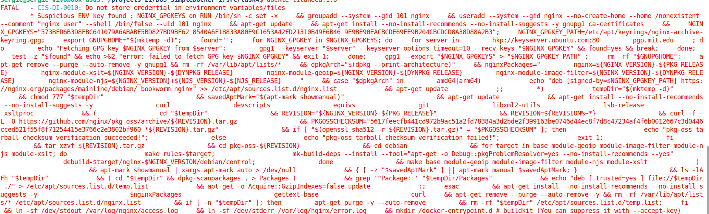
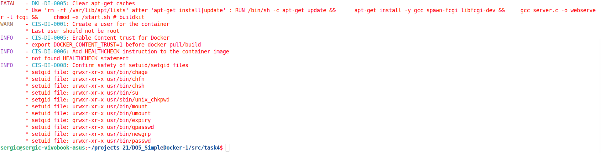
- `DKL-DI-0005: Clear apt-get caches` данная ошибка возникает, так как мы не чистим кэш от библиотек после их установки.  

- `CIS-DI-0001: Create a user for the container` нужно задать пользователя для контейнера.  

- `CIS-DI-0005: Enable Content trust for Docker` нужно включить доверие к контену докера.  

- `CIS-DI-0006: Add HEALTHCHECK instruction to the container image` нужно добавить отслеживание состояние приложения.  

- `CIS-DI-0008: Confirm safety of setuid/setgid files` нужно удалить или ограничить права setuid/setgid у перчисленных файлов.  
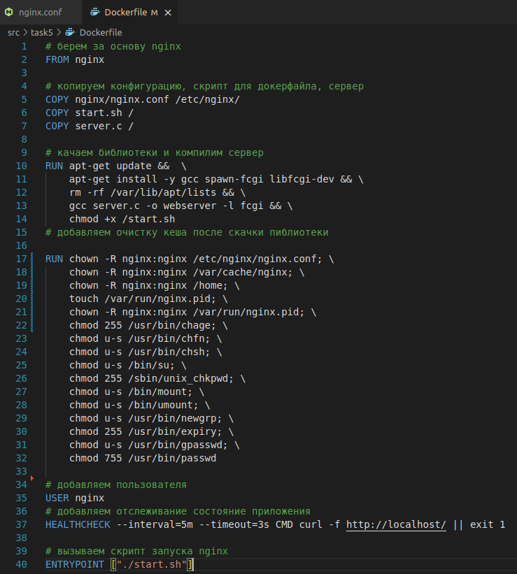

- Вызовем buil.sh  и команду `export DOCKER_CONTENT_TRUST=1`.  
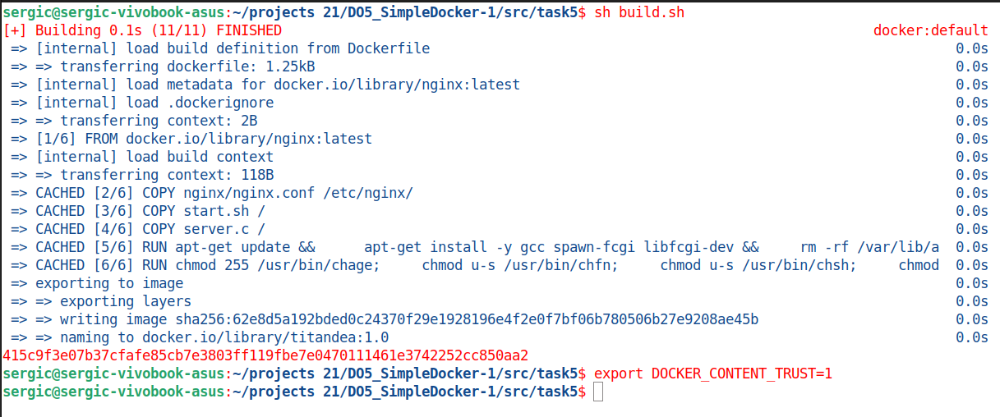

- Просканируем наш образ. Как видим осталась только ошибка от nginx.  
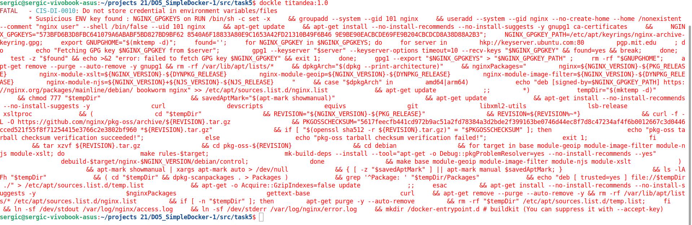

- Проверим, что по localhost:80 доступна страничка написанного мини сервера.  
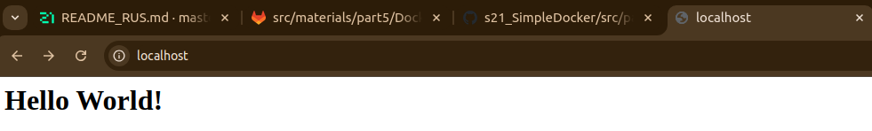

- Проверим, что по localhost:80/status отдается страничка со статусом nginx.  
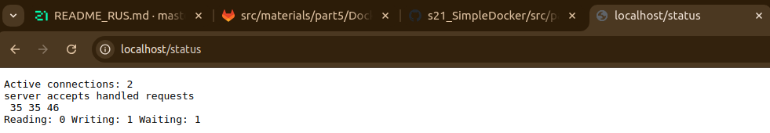

## Part 6. Базовый Docker Compose

- Установим docker-compose `sudo curl -L "https://github.com/docker/compose/releases/download/1.29.2/docker-compose-$(uname -s)-$(uname -m)" -o /usr/local/bin/docker-compose`.  

- Установим право на выполнение `sudo chmod +x /usr/local/bin/docker-compose`.  

- Провемрим версию `docker-compose --version`.  
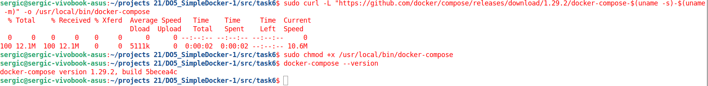

- Напиши файл docker-compose.yml, с помощью которого:

    1) Подними докер-контейнер из Части 5 (он должен работать в локальной сети, т. е. не нужно использовать инструкцию EXPOSE и мапить порты на локальную машину).

    2) Подними докер-контейнер с nginx, который будет проксировать все запросы с 8080 порта на 81 порт первого контейнера.
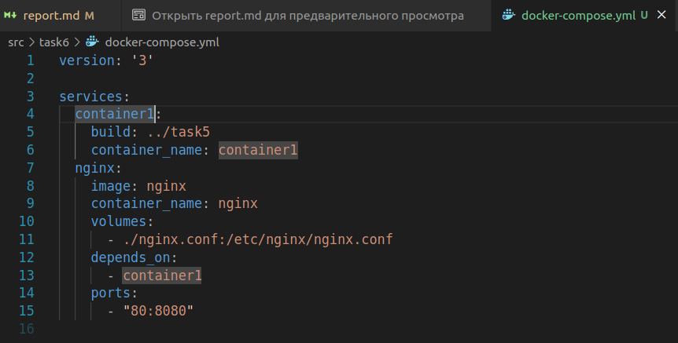
- В это файле описан процесс сборки двух конитейнеров: первый контейнер собирается из конфигурайии 5 задания но без мапинга портов под именем container1. Второй контейнер называется nginx, собирается на основе образа nginx, vонтирует локальный файл nginx.conf в контейнер по пути /etc/nginx/nginx.conf, зависит от container1, запросы на порт 80 на вашей локальной машине будут перенаправлены на порт 8080 внутри контейнера nginx.
- Конфигурация второго контейнера.  
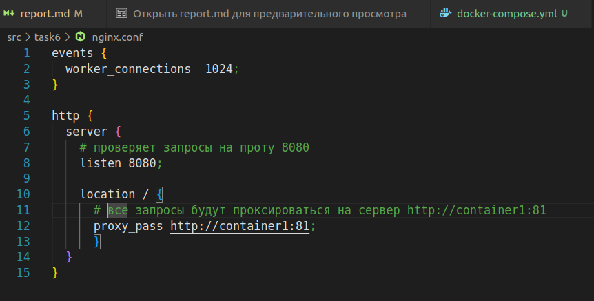

- Проверим, что по localhost:80 доступна страничка написанного мини сервера.  
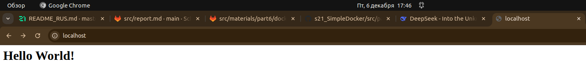

- Проверим, что по localhost:80/status отдается страничка со статусом nginx.  
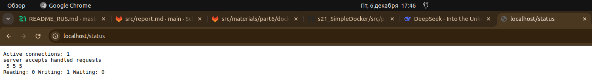